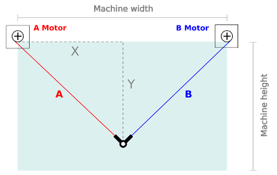

# **vPlot**

**vPlot** is a vertical printer, a kind of printer that draws lines and shapes by moving a pen on a vertical surface using two motors and gravity force.

## **Features**

- 
- DXF file support
- SVG file support

## **Working principle**

Each pen holder position is defined by two lengths, A and B.

Each lengths is calculated using Pythagoras' theorem.

Usually, the motors are positioned at the same height from the ground.

## **Working area**

vPlot-Layout calculates best print area dimensions by

>- distance between the two motors
>- min ratio between belt tension and pen holder weigth (default 0.5)
>- max ratio between belt tension and pen holder weigth (default 1.5)
>- max ratio between pen holder displacement and belt length changement (default 1.4)

In the blank area all three parameters are respected. In the blue area the load of once belt is less than the minimum allowed load; In the red zone the tension of once belt is higher than the maximum allowed load; In the yellow area the resolution of the plotter is lower than the minimum allowed resolution.

Generally, than larger is the distance between the two motors, than larger is the area of ​​the white zone.

## **vPlot hardware requirements**

The main components are:

>- 1x Arduino Uno R3 board or Mega 2560 R3
>- 1x CNC Shield V3 expansion board
>- 2x DRV8825 stepper motor driver 
>- 2x Stepper motor Nema-17 (min torque 40Ncm)
>- 1x Micro digital servo 
>- 2x Timing belt pulley GT2 20T 5mmn bore
>- 2x Smooth idler pulley with bearings GT2 20T 5mm bore
>- 2x 2,5m GT2 timming belt 
>- 1x 12V/5A power supplier 
>- 1x Pen holder (print with a 3D printer)
>- 2x Motor supports (print with a 3D printer)

## **vPlot software requirements**

For compiling vPlot-Client use:  

>- [Lazarus IDE and FreePascal compiler](https://www.lazarus-ide.org/index.php?page=downloads)

>- [BGRA Controls Library](https://bgrabitmap.github.io/)

For loading server sketch on arduino board use:

>- [Arduino IDE](https://www.arduino.cc/en/Main/Software)

## **Before assembling**

Set the Vref current on DRV8825 stepper drivers. See the guide

>- [How to control a stepper motor with DRV8825](https://www.makerguides.com/drv8825-stepper-motor-driver-arduino-tutorial/)

## **Connecting to Arduino**

Nema 17 motors have 200 steps for rotation but by enabling microsteps on the Pololu drivers we can obtain up to 3200 steps for rotation which allows for much more precision. For doing that add two jumpers on green pins.

 

Then
- Mount the two stepper drivers on CNC schield board;
- Connect motors to the green pins;  
- Connect servo-motor to blu pins.

 

- Mount CNC Shield on arduino board;
- Connect Arduino board to PC by usb port and load server sketch.
- Connect 12V power supply to CNC schield;
- Open and use vPlot-Client to control Server

## **LICENSE**

[GNU General Public License v3.0](LICENSE)